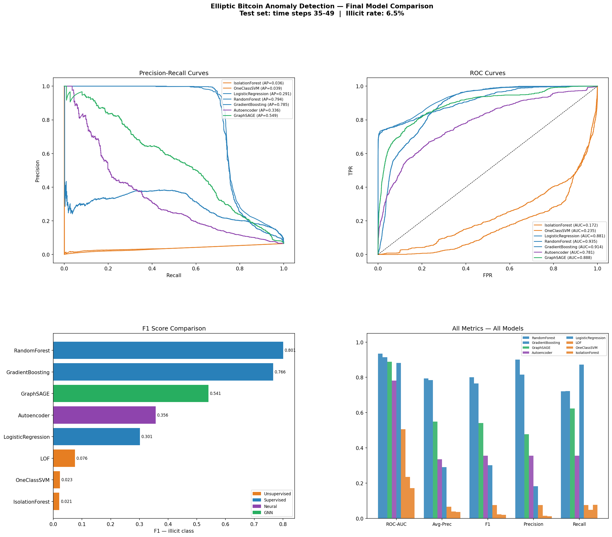
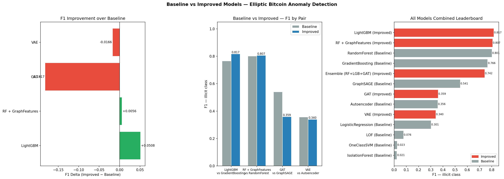
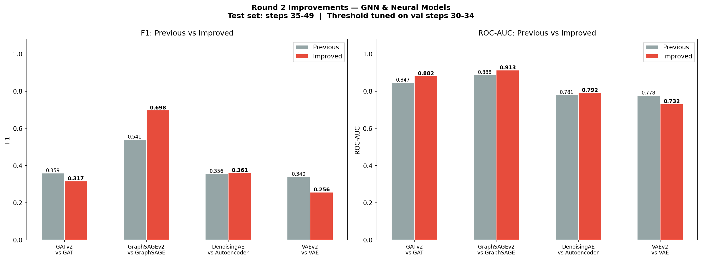

# Elliptic Bitcoin Anomaly Detection


Detecting illicit Bitcoin transactions using the [Elliptic dataset](https://www.kaggle.com/datasets/ellipticco/elliptic-data-set) — a real-world graph of 203,769 Bitcoin transactions labeled as illicit (money laundering, scams) or licit.

Benchmarks **13 model variants** across 4 paradigms — unsupervised, supervised, deep neural, and graph neural — with three rounds of systematic improvement, Optuna hyperparameter tuning, and SHAP explainability.

---

## Results

> Test set: time steps 35–49 (temporal split, matches Elliptic paper). Illicit rate: 6.5%.

### Full Leaderboard — All Rounds

| Rank | Model | Version | F1 (illicit) | ROC-AUC | Avg Precision |
|------|-------|---------|:------------:|:-------:|:-------------:|
| 1 | **GradientBoosting** | Optuna tuned | **0.824** | 0.920 | — |
| 2 | LightGBM | Round 1 | 0.817 | 0.930 | 0.804 |
| 3 | RF + Graph Features | Round 1 | 0.807 | **0.942** | 0.800 |
| 4 | Random Forest | Baseline | 0.801 | 0.935 | 0.794 |
| 5 | GradientBoosting | Baseline | 0.766 | 0.914 | 0.785 |
| 6 | GraphSAGEv2 | Round 2 | 0.698 | 0.913 | 0.720 |
| 7 | GraphSAGE | Optuna tuned | 0.688 | — | — |
| 8 | GraphSAGE | Baseline | 0.541 | 0.888 | 0.549 |
| 9 | DenoisingAE | Round 2 | 0.361 | 0.792 | 0.366 |
| 10 | GAT | Round 1 | 0.359 | 0.847 | 0.389 |
| 11 | Autoencoder | Baseline | 0.356 | 0.781 | 0.336 |
| 12 | VAE | Round 1 | 0.340 | 0.778 | 0.310 |
| 13 | GATv2 | Round 2 | 0.317 | 0.882 | 0.376 |
| 14 | Logistic Regression | Baseline | 0.302 | 0.881 | 0.291 |
| 15 | VAEv2 | Round 2 | 0.256 | 0.732 | 0.161 |
| 16 | LOF | Baseline | 0.076 | 0.506 | 0.066 |
| 17 | One-Class SVM | Baseline | 0.023 | 0.235 | 0.039 |
| 18 | Isolation Forest | Baseline | 0.021 | 0.172 | 0.036 |

**Primary metric: F1 on illicit class.** Accuracy is misleading at 6.5% illicit rate.

### Improvement Journey

| Model | Baseline | Round 1 | Round 2 | Optuna | Best |
|-------|:--------:|:-------:|:-------:|:------:|:----:|
| GradientBoosting | 0.766 | 0.817 (LGB) | — | **0.824** | **0.824** |
| Random Forest | 0.801 | 0.807 (+graph) | — | 0.797 | 0.807 |
| GraphSAGE | 0.541 | — | **0.698** (+3L) | 0.688 | **0.698** |
| Autoencoder | 0.356 | 0.340 (VAE) | 0.361 (DAE) | — | 0.361 |
| GAT | — | 0.359 | 0.317 (v2) | — | 0.359 |

### Key Takeaways

- **GBM + Optuna = F1 0.824** — right learning rate and depth outweigh model family choice
- **GraphSAGEv2 = biggest GNN jump (+15.7 F1)** — 3 layers + LayerNorm + self-loops captures 3-hop money laundering chains
- **GAT consistently underperforms GraphSAGE** across all variants — attention overfits sparse graph topology; mean aggregation is more stable
- **Supervised >> Unsupervised** (F1 0.82 vs 0.08) — illicit transactions do not cluster in feature space
- **Autoencoder score inverts** — illicit txs reconstruct with *lower* MSE (they follow templated patterns); high error ≠ anomaly
- **VAE worse than AE** — ELBO adds noise; raw MSE is the better anomaly signal here
- **Three cross-model robust features:** `lf_53`, `lf_90`, `af_70` rank top-20 in RF (SHAP), GBM (SHAP), and GraphSAGE (gradient attribution)
- **Concept drift is real** — illicit rate drops 11.6% → 6.5% between train and test; random split inflates all metrics

---

## Dataset

The [Elliptic Data Set](https://www.kaggle.com/datasets/ellipticco/elliptic-data-set) was published by Elliptic, a blockchain analytics company.

| File | Size | Description |
|------|------|-------------|
| `elliptic_txs_features.csv` | 657 MB | 203,769 transactions × 165 anonymous features |
| `elliptic_txs_classes.csv` | 3.2 MB | Transaction labels |
| `elliptic_txs_edgelist.csv` | 4.3 MB | 234,355 directed edges |

| Class | Count | % | Meaning |
|-------|-------|---|---------|
| `1` illicit | 4,545 | 2% | Money laundering, scams, ransomware |
| `2` licit | 42,019 | 21% | Exchanges, wallets, services |
| `unknown` | 157,205 | 77% | Unlabeled |

**Features:** Col 0 = txId · Col 1 = time_step (1–49) · Cols 2–94 = 93 local features · Cols 95–165 = 71 aggregated neighborhood features. Names not published by Elliptic.

**Temporal structure:** 49 time steps over ~2 years. Steps 1–43 labeled; 44–49 unlabeled.

---

## Methodology

### Temporal Train / Validation / Test Split

| Split | Steps | Purpose |
|-------|-------|---------|
| Train | 1–34 | Model training |
| Validation | 30–34 | Threshold tuning (neural models) |
| Test | 35–49 | Final evaluation |

Random shuffling is explicitly avoided — this is a time-series dataset. Shuffling leaks future patterns into training and produces metrics that don't reflect real deployment.

### Evaluation Protocol
| Paradigm | Training data | Evaluated on |
|----------|--------------|-------------|
| Unsupervised | All train rows (incl. unknown) | Labeled test rows |
| OCSVM / AE / VAE | Licit-only train rows | Labeled test rows |
| Supervised | Labeled train rows | Labeled test rows |
| GNN | Full graph, supervised by train labels | Labeled test nodes |

---

## Methods

### Unsupervised
| Method | Notes |
|--------|-------|
| Isolation Forest | contamination=0.1 |
| Local Outlier Factor | Transductive — applied to test set directly |
| One-Class SVM | nu=0.05, RBF, trained on licit-only |

### Supervised
| Method | Notes |
|--------|-------|
| Logistic Regression | L2, `class_weight='balanced'` |
| Random Forest | 100 trees, `class_weight='balanced'` |
| Gradient Boosting | sklearn GBM → Optuna tuned (best: n=245, depth=8, lr=0.121) |
| **LightGBM** | `scale_pos_weight`, 500 trees, max_depth=8 |
| **RF + Graph Features** | + in/out degree, PageRank, clustering coefficient |

### Neural
| Method | Notes |
|--------|-------|
| Autoencoder | 166→128→64→32→64→128→166. Licit-only train. MSE score (inverted). |
| Denoising AE | 166→256→128→64→8→64→128→256→166. Latent=8, noise_std=0.1. F1-optimal threshold on val. |
| VAE | Standard beta-VAE, beta=1.0 |
| VAEv2 | Deeper 256-hidden, beta=0.01, ELBO score |

### Graph Neural Network
| Method | Notes |
|--------|-------|
| GraphSAGE | 2-layer, hidden=128, mean aggregation, 200 epochs |
| GraphSAGE (tuned) | Optuna: hidden=256, dropout=0.45, lr=0.0038, 274 epochs |
| **GraphSAGEv2** | 3-layer, hidden=256, LayerNorm, self-loops, 250 epochs |
| GAT | 2-layer, 4 heads, concat — underperforms |
| GATv2 | 3-layer, 2 heads, residual, LayerNorm — still underperforms |

---

## GNN Ablation Study

`scripts/gnn_experiments.py` runs 10 controlled experiments isolating the effect of each architectural choice.

| Exp | Model | Config | F1 | AUC | Avg-Prec |
|-----|-------|--------|:--:|:---:|:--------:|
| 1 | GraphSAGE | 2L h=64 — minimal baseline | 0.528 | 0.887 | 0.519 |
| 2 | GraphSAGE | 2L h=128 | 0.577 | 0.896 | 0.603 |
| 3 | GraphSAGE | 2L h=256 | 0.580 | 0.895 | 0.595 |
| 4 | GraphSAGE | 2L h=128 300 epochs | 0.597 | 0.897 | 0.607 |
| 5 | GraphSAGE | 3L h=128 — deeper | 0.615 | 0.899 | 0.611 |
| 6 | GraphSAGEv2 | 3L h=256 + LayerNorm + self-loops | 0.683 | 0.906 | 0.704 |
| **7** | **GraphSAGE** | **Optuna best: 3L h=256 lr=0.0038 274ep** | **0.690** | 0.901 | **0.706** |
| 8 | GAT | 2L 4 heads baseline | 0.307 | 0.824 | 0.366 |
| 9 | GAT | 2L 2 heads | 0.341 | 0.864 | 0.419 |
| 10 | GATv2 | 3L 2 heads + residual + LayerNorm | 0.382 | 0.887 | 0.547 |

**What each experiment proves:**
- **Exps 1–3:** Hidden dim 64→256 gives +5.2 F1; diminishing returns beyond 128
- **Exps 2 vs 4:** Extra 100 epochs adds +2.0 F1 — training duration matters
- **Exps 2 vs 5:** 2L→3L adds +3.8 F1 — depth captures 3-hop laundering chains
- **Exps 5 vs 6:** LayerNorm + self-loops adds +6.8 F1 — essential at 3 layers
- **Exps 6 vs 7:** Optuna lr tuning adds +0.6 F1 on top of architecture
- **Exps 8–10:** GAT improves with fewer heads and residuals but never beats GraphSAGE — mean aggregation outperforms attention on sparse Bitcoin graph (avg degree 2.3)

### GNN Progression


### Top-5 GNN Radar Chart


---

## Explainability

SHAP TreeExplainer for RF + GBM, gradient attribution for GraphSAGE.

### SHAP — Random Forest (top features by mean |SHAP|)


### SHAP Beeswarm — direction and magnitude per sample


### GraphSAGE Gradient Attribution


### Cross-Model Feature Agreement
| Agreement | Features |
|-----------|----------|
| RF ∩ GBM (7/20) | `lf_18`, `lf_47`, `lf_53`, `lf_59`, `lf_76`, `lf_90`, `af_70` |
| RF ∩ GBM ∩ GNN (3/20) | **`lf_53`**, **`lf_90`**, **`af_70`** |

These three features rank top-20 regardless of model family — strongest consistent signals in the dataset.

---

## Project Structure

```
├── config.py                    # paths, constants, label map, random seed
├── download_data.py             # download dataset via kagglehub
├── requirements.txt
├── HANDOFF.md                   # technical decisions, known issues, full history
│
├── src/
│   ├── data_loader.py           # load_features(), load_classes(), load_all()
│   ├── preprocessing.py         # temporal train/val/test split pipelines
│   ├── models.py                # sklearn model factories
│   ├── autoencoder.py           # Autoencoder + DenoisingAutoencoder, F1-optimal threshold
│   ├── vae.py                   # VAE + VAEv2, ELBO score, F1-optimal threshold
│   ├── gnn.py                   # GraphSAGE + GraphSAGEv2 (3-layer, LayerNorm)
│   ├── gat.py                   # GAT + GATv2 (3-layer, residual, heads=2)
│   ├── graph_features.py        # degree, PageRank, clustering from edgelist
│   ├── graph_utils.py           # build PyG Data object
│   └── evaluation.py            # metrics, confusion matrix, PR/ROC plots
│
├── scripts/
│   ├── 01_eda.py                # class distribution, temporal viz, feature dists
│   ├── 02_unsupervised.py       # IsolationForest, LOF, OCSVM
│   ├── 03_supervised.py         # RF, GBM, LogReg + feature importance
│   ├── 04_autoencoder.py        # baseline autoencoder
│   ├── 05_gnn.py                # baseline GraphSAGE
│   ├── 06_explainability.py     # SHAP + gradient attribution
│   ├── 07_final_comparison.py   # all baseline models leaderboard
│   ├── 08_tune_and_save.py      # Optuna tuning RF/GBM/GraphSAGE (40 trials each)
│   ├── 09_tuned_comparison.py   # baseline vs tuned comparison
│   ├── 10_improved_models.py    # LightGBM, RF+graph features, GAT, VAE, Ensemble
│   ├── 11_improved_comparison.py# round 1 improvement deltas + plots
│   └── 12_deep_improved.py      # GATv2, GraphSAGEv2, DenoisingAE, VAEv2
│
├── models/                      # saved weights
│   ├── scaler.joblib · scaler_graph_features.joblib
│   ├── rf_tuned.joblib · gb_tuned.joblib · lightgbm.joblib
│   ├── rf_graph_features.joblib
│   ├── autoencoder.pt · denoising_ae.pt
│   ├── vae.pt · vaev2.pt
│   ├── graphsage.pt · graphsage_tuned.pt · graphsagev2.pt
│   └── gat.pt · gatv2.pt
│
├── reports/                     # auto-generated plots + CSVs
│   ├── leaderboard.csv · combined_leaderboard.csv · improvement_delta.csv
│   ├── final_comparison.png · improvement_comparison.png · deep_improvement_comparison.png
│   ├── shap_rf_bar.png · shap_rf_beeswarm.png · shap_gbm_bar.png
│   ├── shap_rf_dependence.png · shap_rf_waterfall_illicit.png
│   └── gnn_gradient_attribution.png
│
└── data/                        # gitignored — run download_data.py
```

---

## Setup

### Requirements
- Python 3.10+
- CUDA GPU recommended (RTX 5070 Ti Laptop used; CPU fallback available)

### Install

```bash
python -m venv .venv
.venv\Scripts\activate           # Windows
source .venv/bin/activate        # Linux/Mac

pip install -r requirements.txt

# GPU PyTorch (CUDA 12.8 — adjust for your driver)
pip install torch --index-url https://download.pytorch.org/whl/cu128

# PyTorch Geometric
pip install torch_geometric
pip install pyg_lib torch_scatter torch_sparse torch_cluster torch_spline_conv \
    -f https://data.pyg.org/whl/torch-2.7.0+cu128.html
```

### Download Dataset

```bash
python download_data.py
```

Requires a [Kaggle account](https://www.kaggle.com/) and `~/.kaggle/kaggle.json`.

### Run Pipeline

```bash
# baseline
python scripts/01_eda.py
python scripts/02_unsupervised.py
python scripts/03_supervised.py
python scripts/04_autoencoder.py
python scripts/05_gnn.py
python scripts/06_explainability.py
python scripts/07_final_comparison.py

# tuning + improvements
python scripts/08_tune_and_save.py      # ~20 min GPU
python scripts/09_tuned_comparison.py
python scripts/10_improved_models.py    # ~10 min GPU
python scripts/11_improved_comparison.py
python scripts/12_deep_improved.py      # ~15 min GPU
```

---

## Visual Results

### Full Model Comparison


### Round 1 Improvement (new model families)


### Round 2 Improvement (architecture upgrades)


### Confusion Matrix — Best Model (GBM tuned)


---

## Known Issues & Design Notes

| Issue | Detail |
|-------|--------|
| `kagglehub>=1.0.0` import error | Pin to `0.3.6`. `get_web_endpoint` missing from `kagglesdk`. |
| PyG extension warnings | `pyg-lib`, `torch-scatter`, `torch-sparse` built for torch 2.7, used with 2.11. Non-fatal — pure Python fallback. |
| LOF transductive | No continuous score. Applied to test set directly. |
| AE/VAE score inversion | Illicit = lower reconstruction error. Auto-detected via ROC-AUC comparison on val set. |
| Feature names unknown | Elliptic does not publish semantics. Columns named `lf_1..93` and `af_1..72`. |
| Windows console unicode | Avoid arrow/tick characters in print() — cp1252 codec breaks on Windows terminal. |
| GAT underperforms throughout | Attention mechanism overfits sparse graph. GraphSAGE mean aggregation more stable. |
| VAEv2 worse than AE | ELBO score adds KL noise. Raw MSE is better anomaly signal for this task. |

---

## Environment

| Component | Version |
|-----------|---------|
| Python | 3.12 |
| PyTorch | 2.11.0+cu128 |
| torch_geometric | 2.8.0 |
| scikit-learn | 1.9.0 |
| LightGBM | 4.6.0 |
| SHAP | 0.52.0 |
| Optuna | 4.9.0 |
| networkx | 3.6.1 |
| GPU | NVIDIA RTX 5070 Ti Laptop (12 GB VRAM) |
| CUDA Driver | 592.01 (CUDA 13.1) |

---

## References

- Weber, M. et al. (2019). [Anti-Money Laundering in Bitcoin: Experimenting with Graph Convolutional Networks for Financial Forensics](https://arxiv.org/abs/1908.02591). KDD Workshop.
- Elliptic Data Set: [kaggle.com/datasets/ellipticco/elliptic-data-set](https://www.kaggle.com/datasets/ellipticco/elliptic-data-set)
- Hamilton, W. et al. (2017). [Inductive Representation Learning on Large Graphs](https://arxiv.org/abs/1706.02216). NeurIPS. (GraphSAGE)
- Velickovic, P. et al. (2018). [Graph Attention Networks](https://arxiv.org/abs/1710.10903). ICLR. (GAT)
- Lundberg, S. & Lee, S. (2017). [A Unified Approach to Interpreting Model Predictions](https://arxiv.org/abs/1705.07874). NeurIPS. (SHAP)
- Akiba, T. et al. (2019). [Optuna: A Next-generation Hyperparameter Optimization Framework](https://arxiv.org/abs/1907.10902). KDD.
