# Elliptic Bitcoin Anomaly Detection


Detecting illicit Bitcoin transactions using the [Elliptic dataset](https://www.kaggle.com/datasets/ellipticco/elliptic-data-set) — a real-world graph of 203,769 Bitcoin transactions labeled as illicit (money laundering, scams) or licit.

**48 experiments** across 5 improvement rounds covering unsupervised, supervised, deep neural, graph neural, semi-supervised, ensemble, and topological methods — with Optuna hyperparameter tuning, SHAP explainability, and EVT-based anomaly thresholding.

---

## Results

> Test set: time steps 35–49 (temporal split, matches Elliptic paper). Illicit rate: 6.5%.

### Top-10 Leaderboard

| Rank | Model | Category | F1 (illicit) | ROC-AUC | Avg Precision |
|------|-------|----------|:------------:|:-------:|:-------------:|
| 1 | **GBM + Structural Features** | Supervised | **0.8265** | 0.9243 | 0.8031 |
| 2 | GradientBoosting (Optuna) | Supervised | 0.8241 | 0.9204 | — |
| 3 | GBM + PseudoLabels | Semi-supervised | 0.8235 | 0.9240 | 0.8040 |
| 4 | Ensemble (GBM+LGBM+SAGEv2) | Ensemble | 0.821 | 0.924 | 0.802 |
| 5 | LightGBM | Supervised | 0.817 | 0.930 | 0.804 |
| 6 | GBM + Temporal Rolling | Supervised | 0.8179 | **0.9300** | 0.8017 |
| 7 | RF + Graph Features | Supervised | 0.807 | 0.942 | 0.800 |
| 8 | Random Forest | Supervised | 0.801 | 0.935 | 0.794 |
| 9 | SAGEv2 + PseudoLabels | Semi-sup GNN | 0.7293 | 0.8901 | 0.7517 |
| 10 | GraphSAGEv2 | GNN | 0.698 | 0.913 | 0.720 |

**Primary metric: F1 on illicit class.** Accuracy is meaningless at 6.5% illicit rate.

> Ranks 1–3 above (0.8265/0.8241/0.8235) are **not statistically distinguishable** — see [Statistical Rigor](#statistical-rigor--publication-readiness) below.

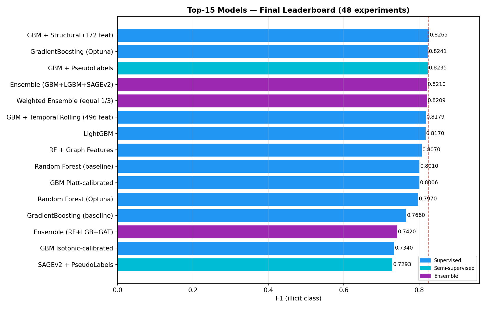

### Improvement Journey — 5 Rounds

| Model | Baseline | Round 1 | Round 2 | Optuna | Round 3–5 | Best |
|-------|:--------:|:-------:|:-------:|:------:|:----------:|:----:|
| GradientBoosting | 0.766 | 0.817 (LGBM) | — | 0.824 | **0.827** (+struct) | **0.827** |
| Random Forest | 0.801 | 0.807 (+graph) | — | 0.797 | — | 0.807 |
| GraphSAGE | 0.541 | — | 0.698 (+3L) | 0.688 | 0.729 (+pseudo) | 0.729 |
| Autoencoder | 0.356 | 0.340 (VAE) | 0.361 (DAE) | — | 0.407 (β-VAE) | 0.407 |
| GAT | — | 0.359 | 0.317 (v2) | — | — | 0.359 |

### Round Progression

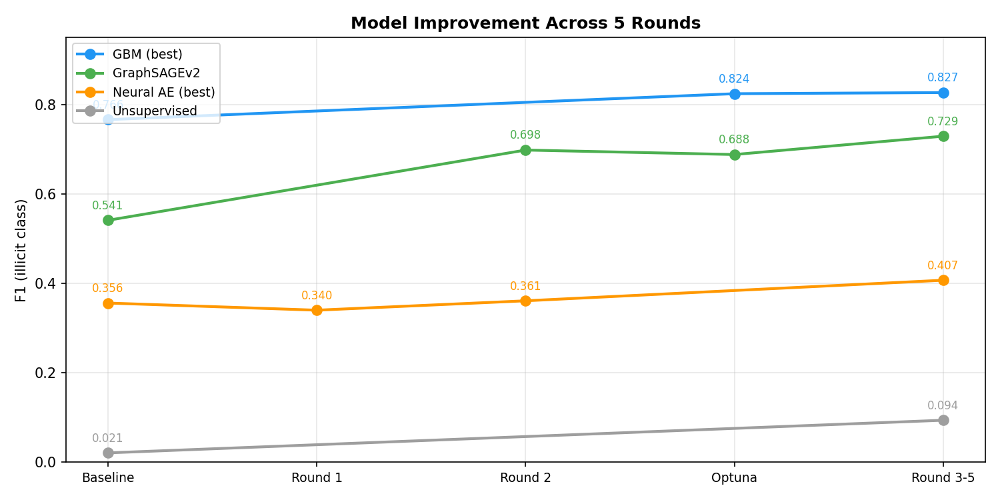

### Best per Tier — F1 vs ROC-AUC

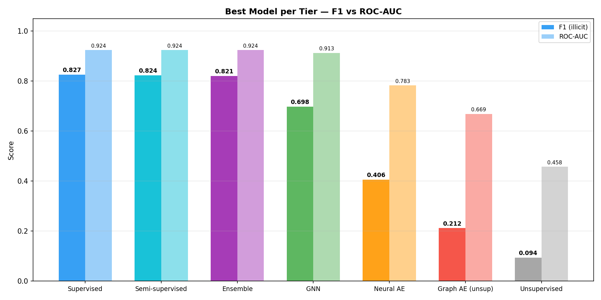

### Key Takeaways

- **Best model: GBM + 7 structural topology features (F1=0.8265)** — degree, clustering, ego-density, OddBall deviation add marginal but consistent signal on top of 165 tabular features
- **GBM Optuna = F1 0.824** — right learning rate and depth (n=245, depth=8, lr=0.121) outweigh model family
- **Semi-supervised pseudo-labels: +3.1 F1 on GraphSAGEv2** (0.698→0.729) — graph model benefits more than GBM from unlabeled nodes populating neighborhoods
- **Ensemble of GBM+LGBM+SAGEv2 = F1 0.821** — close to GBM solo; individual model already near ceiling; weighting away from SAGEv2 removes graph signal
- **GraphSAGEv2 biggest GNN jump (+15.7 F1)** — 3 layers + LayerNorm + self-loops captures 3-hop money laundering chains
- **GAT consistently underperforms GraphSAGE** — attention overfits sparse graph (avg degree 2.3); mean aggregation more stable
- **β-VAE best unsupervised (F1=0.407)** — lower β=0.01 (reconstruction-dominated) outperforms higher β; illicit txs reconstruct with *lower* error (templated patterns), so KL regularization hurts
- **Spectral embedding carries no anomaly signal** — Fiedler value ≈ 2 (bipartite-like spectrum); money laundering chains don't form isolated spectral communities
- **Supervised >> Unsupervised** (F1 0.83 vs 0.09) — illicit transactions don't cluster in feature space; supervised labels are essential
- **Three cross-model robust features:** `lf_53`, `lf_90`, `af_70` rank top-20 in RF (SHAP), GBM (SHAP), and GraphSAGE (gradient attribution)
- **Concept drift is real** — illicit rate drops 11.6% → 6.5% train→test; random split inflates all metrics
- **GAT closes most of the gap to GraphSAGE once tuned** — GATv2 Optuna (hidden=64, heads=4, F1=0.5508) jumps +0.234 over untuned GATv2 (0.317), though still trails tuned GraphSAGE (0.688–0.729)
- **DOMINANT and LSTM-AE per-transaction scoring are negative results** — an alpha/epoch grid found no improvement over DOMINANT's baseline (already near ceiling), and scoring individual transactions against their LSTM-AE step template performs *worse* (F1=0.037) than the coarser step-level score (F1=0.122) — the temporal signal genuinely lives at step granularity, not per-transaction
- **GNNExplainer confirms `lf_53`/`lf_90` are causal at the instance level** — present in the top-10 feature mask for 15/15 explained true-positive illicit predictions, not just globally important via SHAP

---

## Statistical Rigor & Publication-Readiness

Four checks added on top of the 48-experiment benchmark, aimed at the gaps that keep most Elliptic papers out of rigorous venues (see `Final-report/elliptic_report.tex` §5.7–5.10 and `HANDOFF.md` for full writeups).

### 1. The top-3 ranking is statistical noise

`scripts/statistical_significance.py` — bootstrap F1 95% CI (1,000 resamples) + McNemar's paired test on GBM+Structural (0.8265) vs GBM-Optuna (0.8241) vs GBM+PseudoLabels (0.8235).

| Model | F1 | 95% CI |
|-------|:--:|:------:|
| GBM + Structural | 0.8265 | [0.8086, 0.8451] |
| GBM (Optuna) | 0.8241 | [0.8057, 0.8406] |
| GBM + PseudoLabels | 0.8235 | [0.8052, 0.8410] |

All three intervals overlap almost entirely; McNemar shows <45 of 16,670 test rows disagree per pair, none significant (p=0.50–1.00). **The 0.827 "best model" claim is a tie, not a ranking** — the real finding is that tabular GBM already sits at its ceiling; neither structural features nor pseudo-labels move it outside sampling noise.

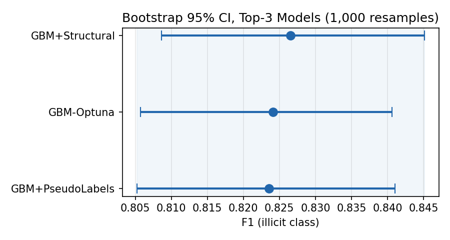

### 2. SOTA comparison — and a graph-leakage caveat, disclosed

Researched real published Elliptic numbers (Weber 2019, Alarab 2020, Pareja/EvolveGCN, Lo 2023) and a 2026 critical re-evaluation (Maganti, arXiv:2604.19514) showing that **essentially every published Elliptic GNN result — ours included — is "transductive"**: the encoder's message passing sees the full graph, including test-period (steps 35–49) edges, during training; only the classification loss is masked to labeled train nodes. Under a strict-inductive protocol (training message passing restricted to steps ≤34), Maganti reports Random Forest at F1=0.821, beating every GNN tested, and GraphSAGE collapsing from 0.689 (strict-inductive) to 0.294 (transductive) on matched seeds.

Our own `src/gnn.py:train_epoch` has this exact leakage — full graph forward pass, loss-only masking. Disclosed rather than hidden. It doesn't touch our tabular GBM, which uses zero graph exposure and already **exceeds Maganti's strict-inductive RF ceiling** (0.824–0.827 vs 0.821).

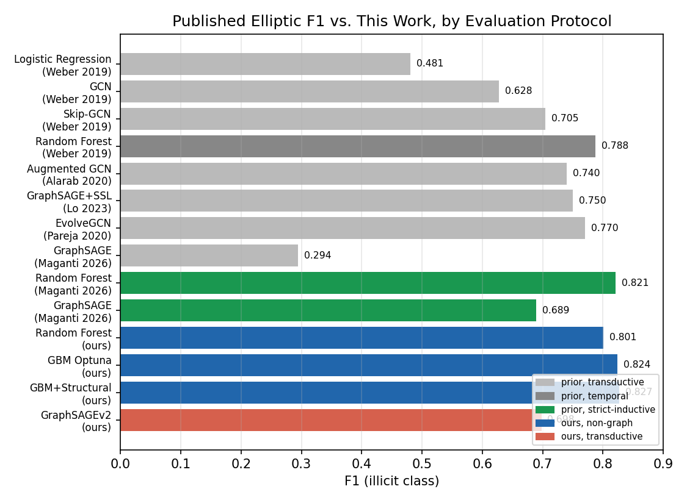

### 3. A second leakage trap: tuning the threshold on training data

`scripts/threshold_leakage_demo.py` — refits GBM on steps 1–29 only (so 30–34 is genuinely unseen) and compares three threshold-selection protocols against the real test set (steps 35–49):

| Protocol | Threshold | F1 at tune time | Real test F1 |
|----------|:---------:|:----------------:|:-------------:|
| Leaky (tune on train) | 0.0050 | **1.0000** | 0.5484 |
| Correct (tune on held-out val) | 0.3367 | 0.9701 | 0.7670 |
| Default (t=0.5, no tuning) | 0.5000 | — | **0.7801** |

Tuning on the model's own training predictions collapses the threshold to 0.005 and reports a perfect F1=1.0 — pure overfitting measured against itself, a 0.45 F1 illusion. But even tuning on genuinely held-out val isn't drift-free: val's illicit rate (16.8%) is closer to train's than to test's post-drift rate (6.5%), so its 0.97 tune-time F1 still overstates the real 0.767. The untuned default threshold actually wins on real test F1 (0.78) — under concept drift, a threshold tuned on any pre-drift data can transfer worse than no tuning at all.

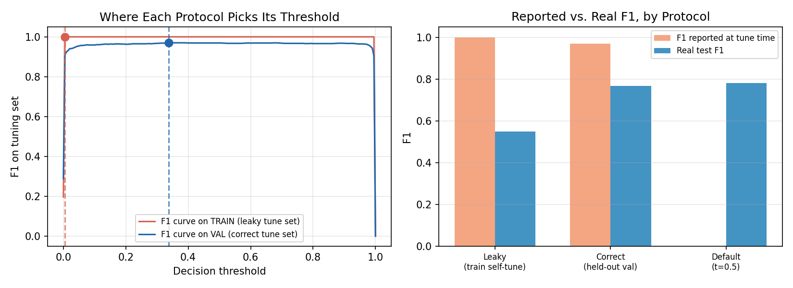

### 4. Runtime is real, GraphSAGE's number needs a caveat too

`scripts/runtime_benchmark.py`, measured on RTX 5070 Ti:

| Model | ms/tx | Note |
|-------|:-----:|------|
| GBM Optuna | 0.0071 | CPU, `predict_proba` |
| GBM + Structural (model only) | 0.0076 | CPU |
| GBM + Structural (+ uncached graph features) | 0.0299 | one-time graph pass, not cached |
| GraphSAGEv2 | 0.0002 | **batch-amortized** — one forward pass scores all 203,769 nodes at once (~45ms total); not the true cost of scoring one new transaction online, which needs k-hop neighborhood assembly first |

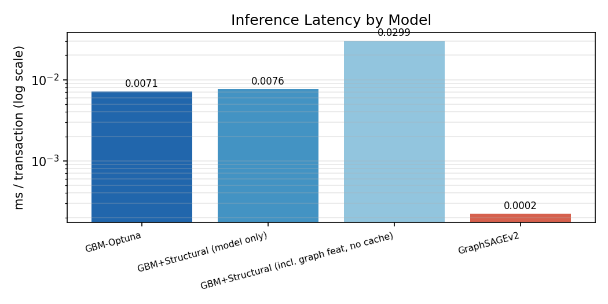

### 5. Error analysis: GBM's misses trace to a real external event

`scripts/error_analysis.py` on GBM-Optuna test predictions (TP=787, FN=296, FP=40, TN=15,547 — precision 0.952, recall 0.727). FN rate is 0–35% for steps 35–42, then **jumps to 92–100% for steps 43–49** — coinciding with a documented dark-market shutdown at step 43 that also explains the 11.6%→6.5% concept drift. Misses are confidently wrong (mean P(illicit)=0.014, 95.6% scored <0.10) — not borderline, so threshold tuning won't fix it; needs concept-drift retraining. The three cross-model robust features (`lf_53`, `lf_90`, `af_70`) separate FN from TP at p<1e-24 — missed post-shutdown illicit transactions numerically mimic the licit population on the model's most-trusted signals.

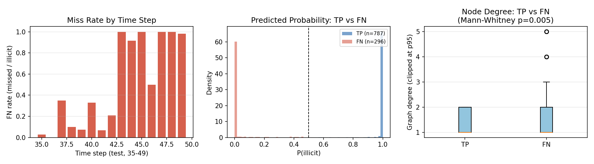

---

## Dataset

The [Elliptic Data Set](https://www.kaggle.com/datasets/ellipticco/elliptic-data-set) was published by Elliptic, a blockchain analytics company.

| File | Size | Description |
|------|------|-------------|
| `elliptic_txs_features.csv` | 657 MB | 203,769 transactions × 165 anonymous features |
| `elliptic_txs_classes.csv` | 3.2 MB | Transaction labels |
| `elliptic_txs_edgelist.csv` | 4.3 MB | 234,355 directed edges |

| Class | Count | % | Meaning |
|-------|-------|---|---------|
| `1` illicit | 4,545 | 2% | Money laundering, scams, ransomware |
| `2` licit | 42,019 | 21% | Exchanges, wallets, services |
| `unknown` | 157,205 | 77% | Unlabeled |

**Features:** Col 0 = txId · Col 1 = time_step (1–49) · Cols 2–94 = 93 local features · Cols 95–165 = 71 aggregated neighborhood features. Names not published by Elliptic.

**Temporal structure:** 49 time steps over ~2 years. Steps 1–43 labeled; 44–49 unlabeled.

### Concept Drift

Illicit rate drops 13.4% → 6.5% train→test. Random split inflates all metrics by ~5–10 F1 points.

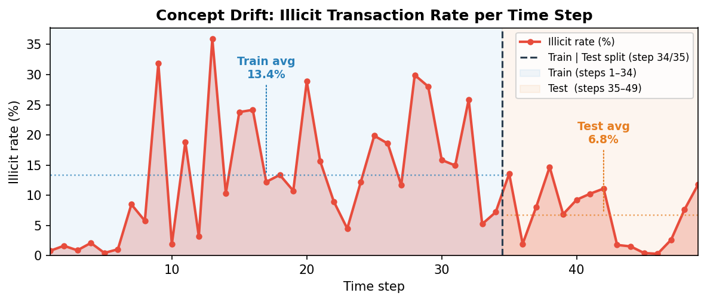

---

## Methodology

### Temporal Train / Validation / Test Split

| Split | Steps | Purpose |
|-------|-------|---------|
| Train | 1–34 | Model training |
| Validation | 30–34 | Threshold tuning (neural/ensemble models) |
| Test | 35–49 | Final evaluation |

Random shuffling is explicitly avoided — this is a time-series dataset. Shuffling leaks future patterns into training and inflates all metrics.

### Evaluation Protocol

| Paradigm | Training data | Threshold |
|----------|--------------|-----------|
| Unsupervised | All train rows (incl. unknown) | F1-optimal on labeled train |
| AE / VAE / OCSVM | Licit-only train rows | F1-optimal on labeled train |
| Supervised | Labeled train rows | Model default (0.5) |
| GNN | Full graph, supervised by train labels | Model default (0.5) |
| Ensemble | Labeled train rows | Grid search on val steps 30–34 |

---

## Methods

### Unsupervised (classical)
| Method | Notes |
|--------|-------|
| Isolation Forest | contamination=0.1 |
| Local Outlier Factor | Transductive — applied to test set directly |
| One-Class SVM | nu=0.05, RBF, licit-only train |
| IsoForest on structural topology | 7 graph features: degree, clustering, OddBall, ego-density |
| IsoForest / OCSVM on spectral embedding | Top-50 eigenvectors of normalized adjacency |

### Supervised
| Method | Notes |
|--------|-------|
| Logistic Regression | L2, `class_weight='balanced'` |
| Random Forest | 100 trees, `class_weight='balanced'` |
| Gradient Boosting | Optuna-tuned (best: n=245, depth=8, lr=0.121, subsample=0.918) |
| LightGBM | `scale_pos_weight`, 500 trees, max_depth=8 |
| RF + Graph Features | + in/out degree, PageRank, clustering coefficient |
| GBM + Structural Features | 165 tabular + 7 topology features (degree, clustering, avg-nb-deg, ego-density, OddBall) |
| GBM + Temporal Rolling | 165 tabular + 330 rolling mean/std features (window=5 time steps) |
| GBM + PseudoLabels | Retrained on 3,653 pseudo-illicit + 97,108 pseudo-licit unlabeled nodes |

### Neural Anomaly Detection
| Method | Notes |
|--------|-------|
| Autoencoder | 166→128→64→32→...→166, licit-only, MSE score (inverted) |
| Denoising AE | Latent=8, noise_std=0.1, F1-optimal threshold on val |
| VAE | Standard β-VAE, β=1.0 |
| VAEv2 | Deeper 256-hidden, β=0.01, ELBO score |
| β-VAE grid search | β ∈ {0.01, 1, 2, 4, 8} — β=0.01 optimal (F1=0.407) |
| LSTM-AE | Per-timestep aggregate → sliding windows T=10 → temporal anomaly scores |
| DOMINANT | GCN-AE: 2-layer GCNConv encoder, attribute + structure decoders, joint MSE+BCE loss |

### Graph Neural Network
| Method | Notes |
|--------|-------|
| GraphSAGE | 2-layer, hidden=128, mean aggregation, 200 epochs |
| GraphSAGE (Optuna) | hidden=256, dropout=0.45, lr=0.0038, 274 epochs |
| GraphSAGEv2 | 3-layer, hidden=256, LayerNorm, self-loops, 250 epochs |
| SAGEv2 + PseudoLabels | 130,655 train nodes (orig 29,894 + 100,761 pseudo-labeled) |
| GAT | 2-layer, 4 heads, concat aggregation |
| GATv2 | 3-layer, 2 heads, residual, LayerNorm |
| GATv2 (Optuna) | hidden=64, heads=4, dropout=0.135, lr=0.0099, 213 epochs — F1=0.5508, +0.234 over untuned GATv2 |

### Ensemble
| Method | Notes |
|--------|-------|
| RF + LGB + GAT | Equal soft vote, threshold on train (Round 1) |
| GBM + LGBM + SAGEv2 | Equal soft vote, threshold grid-searched on val steps 30–34 |
| Weighted variants | 40/40/20, 45/45/10, 50/50/0 — equal weights won |

---

### Precision-Recall Curves

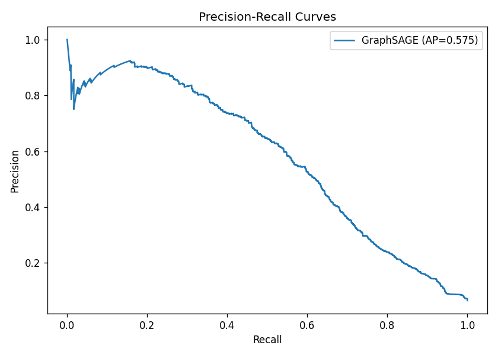

### Confusion Matrices

| Ensemble (GBM+LGBM+SAGEv2) | DOMINANT (Graph AE) |
|:---------------------------:|:-------------------:|
| 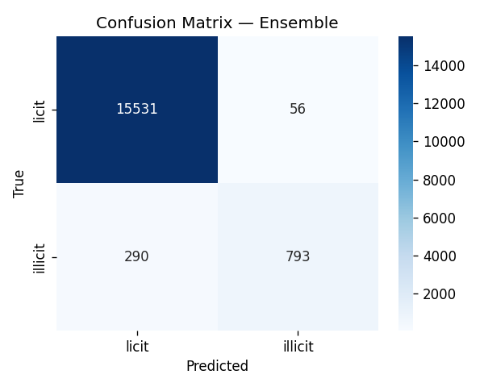 | 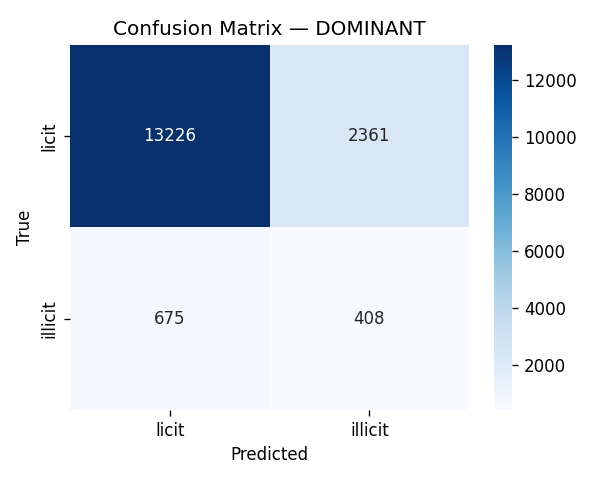 |

### DOMINANT Alpha/Epoch Tuning (Round 6 — negative result)

Grid search over attribute/structure loss weight (alpha) and training length found no improvement over the original baseline — confirms DOMINANT was already at its ceiling on this dataset, not undertrained.

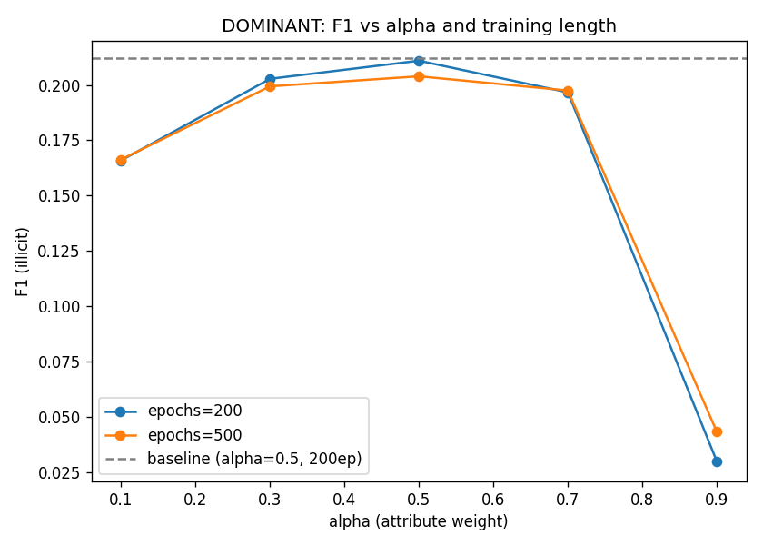

---

## GNN Ablation Study

`scripts/gnn_experiments.py` runs 10 controlled experiments isolating the effect of each architectural choice.

| Exp | Model | Config | F1 | AUC |
|-----|-------|--------|:--:|:---:|
| 1 | GraphSAGE | 2L h=64 — minimal baseline | 0.528 | 0.887 |
| 2 | GraphSAGE | 2L h=128 | 0.577 | 0.896 |
| 3 | GraphSAGE | 2L h=256 | 0.580 | 0.895 |
| 4 | GraphSAGE | 2L h=128 300 epochs | 0.597 | 0.897 |
| 5 | GraphSAGE | 3L h=128 | 0.615 | 0.899 |
| 6 | GraphSAGEv2 | 3L h=256 + LayerNorm + self-loops | 0.683 | 0.906 |
| **7** | **GraphSAGE** | **Optuna: 3L h=256 lr=0.0038 274ep** | **0.690** | 0.901 |
| 8 | GAT | 2L 4 heads | 0.307 | 0.824 |
| 9 | GAT | 2L 2 heads | 0.341 | 0.864 |
| 10 | GATv2 | 3L 2 heads + residual + LN | 0.382 | 0.887 |

- **Exps 1–3:** Hidden dim 64→256 gives +5.2 F1
- **Exps 2 vs 5:** 2L→3L adds +3.8 F1 — depth captures 3-hop laundering chains
- **Exps 5 vs 6:** LayerNorm + self-loops adds +6.8 F1 — essential at 3 layers
- **Exps 8–10:** GAT never beats GraphSAGE — mean aggregation outperforms attention on sparse graph (avg degree 2.3)
- **Exp 10 vs GATv2 Optuna (Round 6):** best hand-tuned GATv2 (0.382) vs Optuna-tuned GATv2 (0.5508, hidden=64, heads=4) — proper hyperparameter search closes most of the GAT/SAGE gap, but SAGE still wins

### GNN Progression
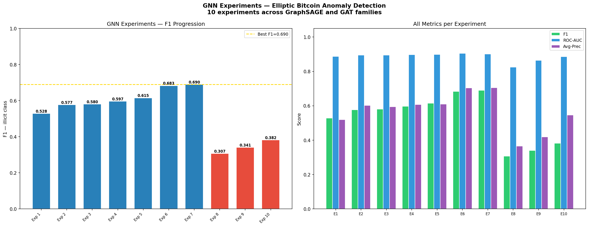

### Top-5 GNN Radar Chart
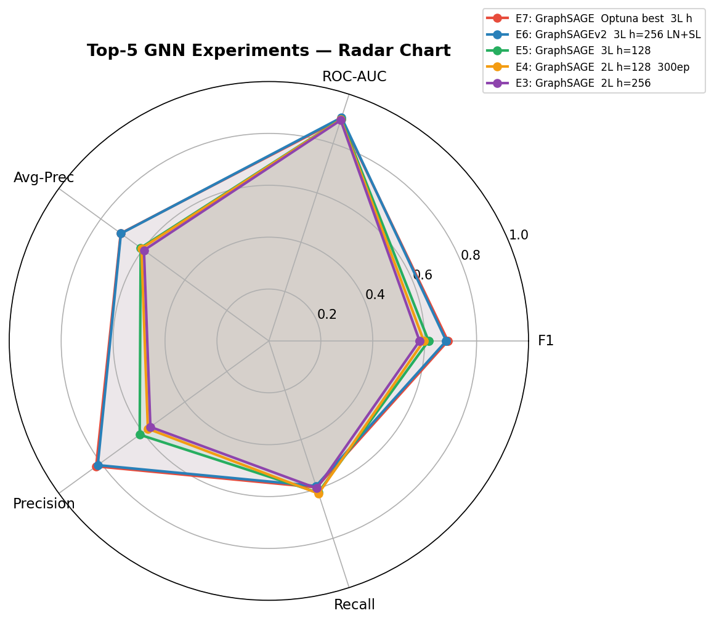

---

## Explainability

SHAP TreeExplainer for RF + GBM, gradient attribution for GraphSAGE.

### beta-VAE: Effect of KL Weight on Performance

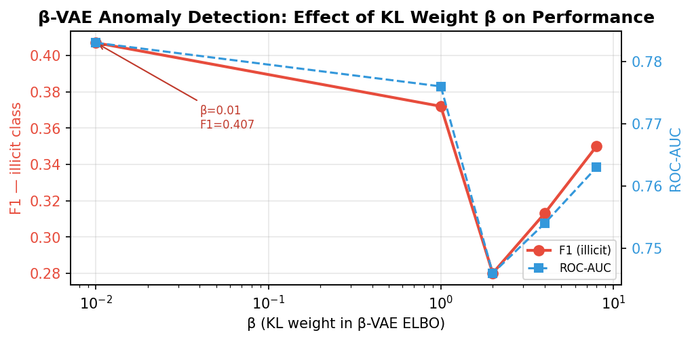

### SHAP — Random Forest
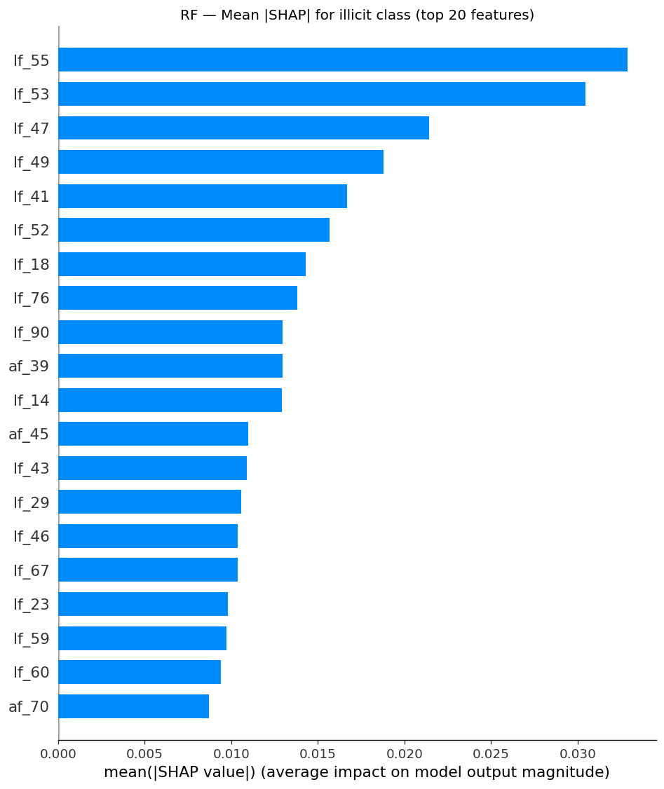

### SHAP Beeswarm — Random Forest
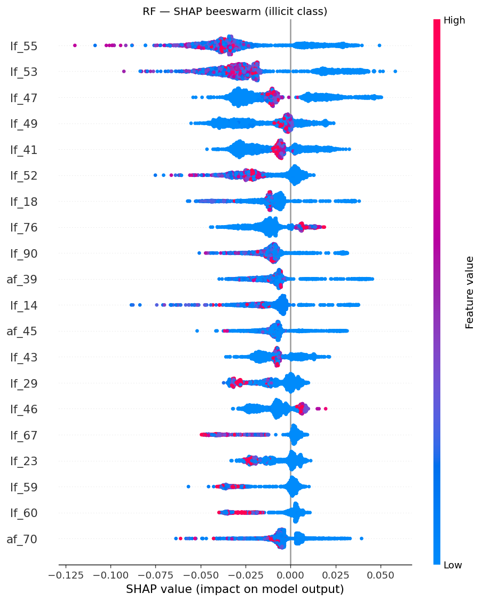

### SHAP — Gradient Boosting
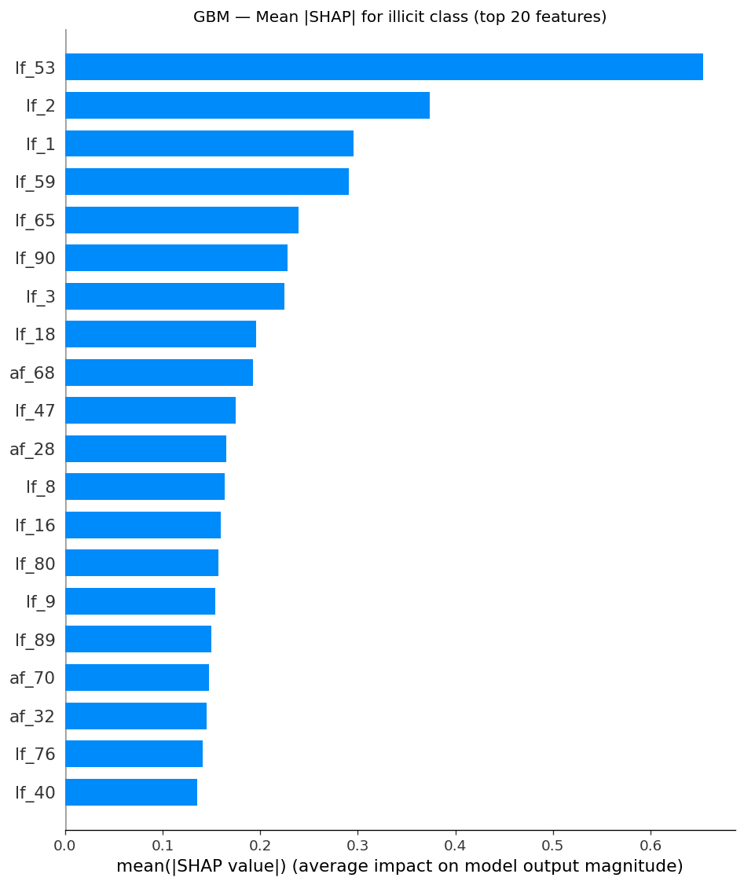

### SHAP Beeswarm — Gradient Boosting
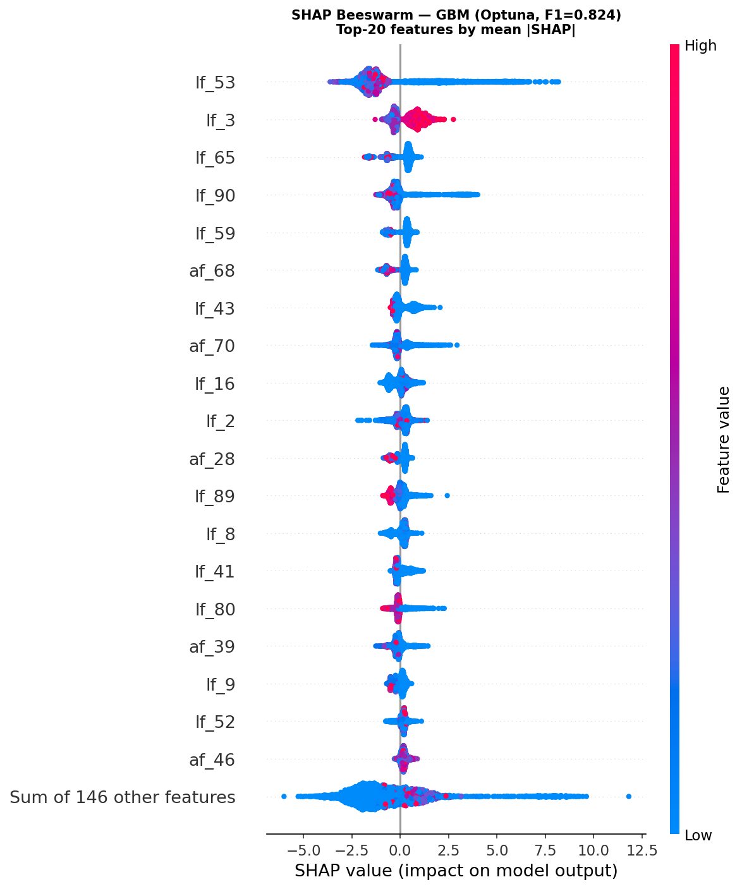

### GraphSAGE Gradient Attribution
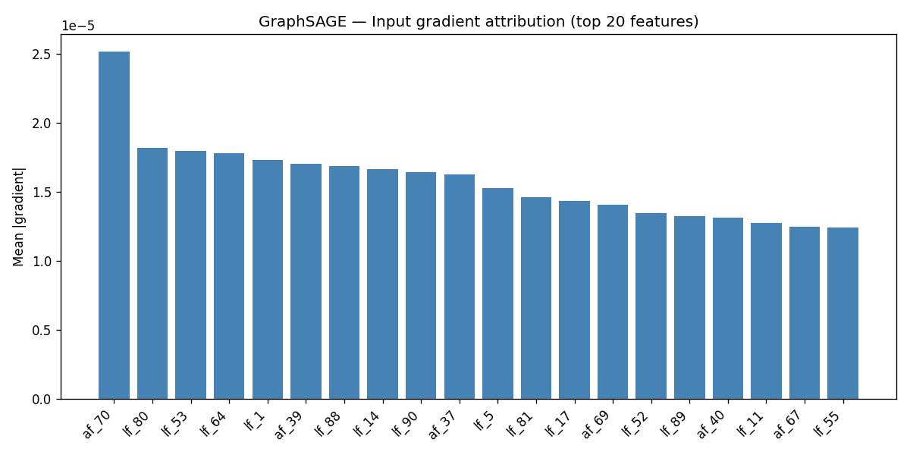

### GNNExplainer — Node-Level Confirmation

`scripts/gnn_explainer_analysis.py` runs `torch_geometric.explain.GNNExplainer` on the 15 highest-confidence true-positive illicit predictions from GraphSAGEv2+PseudoLabels. Unlike SHAP/gradient attribution (global, aggregate importance), this explains individual predictions: which specific input features and which specific neighboring edges drove *that node's* "illicit" classification.

- `lf_53` appears in the top-10 feature mask for **15/15** explained nodes; `lf_90` for 4/15 — the first instance-level (not just global) confirmation that these features are causal to individual predictions
- Repeated high-importance neighbor transactions across multiple explained nodes (one txId shows up as a top-5 important neighbor for 9/15 explained nodes) — consistent with "guilt by association" laundering chains sharing structural hubs
- Output: `reports/gnn_explainer_summary.csv`

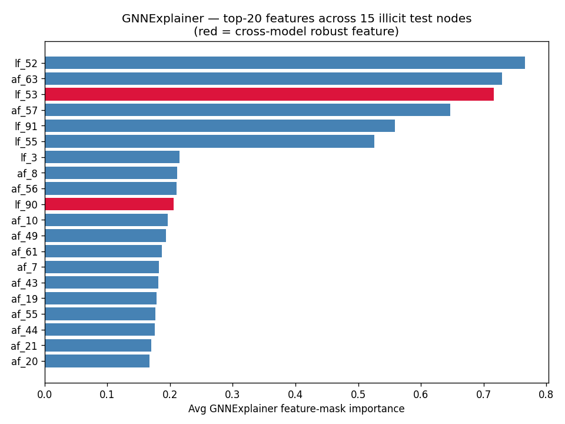

### Cross-Model Feature Agreement

| Agreement | Features |
|-----------|----------|
| RF ∩ GBM (7/20) | `lf_18`, `lf_47`, `lf_53`, `lf_59`, `lf_76`, `lf_90`, `af_70` |
| RF ∩ GBM ∩ GNN (3/20) | **`lf_53`**, **`lf_90`**, **`af_70`** |
| + GNNExplainer node-level (instance-specific) | **`lf_53`** (15/15 nodes), **`lf_90`** (4/15 nodes) |

These three features rank top-20 regardless of model family — strongest consistent signals in the dataset. All three are aggregated neighborhood features (af_ prefix = aggregated), confirming graph structure encodes meaningful signal.

---

## Project Structure

```
├── config.py                    # paths, constants, label map, random seed
├── download_data.py             # download dataset via kagglehub
├── requirements.txt
├── HANDOFF.md                   # full technical decisions, known issues, all 48 experiment results
│
├── src/
│   ├── data_loader.py           # load_features(), load_classes(), load_all()
│   ├── preprocessing.py         # temporal train/val/test split pipelines
│   ├── models.py                # sklearn model factories
│   ├── autoencoder.py           # AE + DenoisingAE, F1-optimal threshold, EVT threshold (GPD)
│   ├── vae.py                   # VAE + VAEv2 + beta-VAE, ELBO score
│   ├── dominant.py              # DOMINANT GCN-AE (attr + structure decoders)
│   ├── lstm_ae.py               # LSTM encoder-decoder, per-timestep sliding windows
│   ├── gnn.py                   # GraphSAGE + GraphSAGEv2 (3-layer, LayerNorm)
│   ├── gat.py                   # GAT + GATv2 (3-layer, residual, heads=2)
│   ├── graph_features.py        # degree, PageRank, clustering from edgelist
│   ├── graph_utils.py           # build PyG Data object
│   ├── inference.py             # load_pipeline() + score_transactions() — production scoring
│   └── evaluation.py            # metrics, confusion matrix, PR/ROC plots
│
├── scripts/
│   ├── eda.py                           # class distribution, temporal viz, feature dists
│   ├── baseline_unsupervised.py         # IsolationForest, LOF, OCSVM
│   ├── baseline_supervised.py           # RF, GBM, LogReg + feature importance
│   ├── baseline_autoencoder.py          # baseline autoencoder
│   ├── baseline_gnn.py                  # baseline GraphSAGE
│   ├── shap_explainability.py           # SHAP + gradient attribution
│   ├── baseline_comparison.py           # all baseline models leaderboard
│   ├── optuna_tuning.py                 # Optuna tuning RF/GBM/GraphSAGE (40 trials each)
│   ├── tuned_comparison.py              # baseline vs tuned comparison
│   ├── improved_models.py               # LightGBM, RF+graph, GAT, VAE, Ensemble (Round 1)
│   ├── improved_comparison.py           # Round 1 improvement deltas + plots
│   ├── deep_architecture_improvements.py# GATv2, GraphSAGEv2, DenoisingAE, VAEv2 (Round 2)
│   ├── gnn_ablation.py                  # 10-experiment GNN ablation study
│   ├── dominant_graph_ae.py             # DOMINANT GCN-AE (Round 3)
│   ├── lstm_autoencoder.py              # LSTM-AE temporal anomaly detection (Round 3)
│   ├── ensemble_soft_vote.py            # GBM+LGBM+SAGEv2 soft-vote ensemble (Round 3)
│   ├── pseudo_label_training.py         # semi-supervised GBM+SAGEv2 (Round 4)
│   ├── beta_vae_gridsearch.py           # beta-VAE grid search (Round 4)
│   ├── structural_graph_features.py     # topology features + GBM (Round 4)
│   ├── spectral_anomaly_detection.py    # spectral embedding IsoForest/OCSVM (Round 4)
│   ├── weighted_ensemble.py             # weighted ensemble sweep (Round 5)
│   ├── probability_calibration.py       # Platt + isotonic calibration (Round 5)
│   ├── temporal_rolling_features.py     # rolling mean/std features (Round 5)
│   ├── lgbm_xgboost_structural.py       # LightGBM/XGBoost on structural features
│   ├── final_leaderboard.py             # full leaderboard table + 3 comparison plots
│   ├── statistical_significance.py      # bootstrap F1 CI + McNemar test, top-3 models
│   ├── runtime_benchmark.py             # per-transaction inference latency (GBM/GraphSAGE)
│   ├── error_analysis.py                # FN/FP breakdown, temporal + feature-level
│   ├── threshold_leakage_demo.py        # threshold-on-train vs threshold-on-val leakage demo
│   ├── significance_plots.py            # plots for the significance/SOTA/runtime items
│   ├── gat_optuna_tuning.py             # GATv2 Optuna tuning (Round 6)
│   ├── dominant_tuning.py               # DOMINANT alpha/epoch grid search (Round 6)
│   ├── gnn_explainer_analysis.py        # GNNExplainer node-level attribution (Round 6)
│   └── lstm_autoencoder_pertx.py        # LSTM-AE per-transaction scoring (Round 6)
│
├── models/                      # saved weights
│   ├── scaler.joblib · scaler_graph_features.joblib · scaler_structural.joblib
│   ├── rf_tuned.joblib · gb_tuned.joblib · lightgbm.joblib
│   ├── rf_graph_features.joblib · gbm_structural.joblib
│   ├── gbm_pseudo.joblib · gbm_temporal_rolling.joblib
│   ├── autoencoder.pt · denoising_ae.pt · dominant.pt · lstm_ae.pt
│   ├── vae.pt · vaev2.pt
│   ├── graphsage.pt · graphsage_tuned.pt · graphsagev2.pt · graphsagev2_pseudo.pt
│   ├── gat.pt · gatv2.pt · gatv2_tuned.pt
│   └── dominant_tuned.pt · lstm_ae_pertx.pt
│
├── reports/                     # auto-generated plots + CSVs
│   ├── final_leaderboard.csv              ← all 48 experiments ranked
│   ├── final_top15_f1.png                 ← top-15 horizontal bar chart
│   ├── final_tier_comparison.png          ← best per tier F1 vs AUC
│   ├── final_round_progression.png        ← improvement across 5 rounds
│   ├── leaderboard.csv · combined_leaderboard.csv
│   ├── cm_DOMINANT.png · cm_Ensemble.png · pr_curves.png
│   ├── shap_rf_bar.png · shap_rf_beeswarm.png · shap_gbm_bar.png
│   ├── gnn_experiments_progression.png · gnn_experiments_radar.png
│   ├── gnn_gradient_attribution.png
│   ├── bootstrap_f1_ci.csv/.png · mcnemar_results.csv · mcnemar_agreement.png
│   ├── sota_comparison.png
│   ├── runtime_benchmark.csv/.png
│   ├── error_analysis_summary.csv · error_analysis_features.csv · error_analysis.png
│   ├── threshold_leakage_demo.csv/.png
│   ├── dominant_tuning.csv/.png
│   └── gnn_explainer_summary.csv · gnn_explainer_feature_importance.png
│
└── data/                        # gitignored — run download_data.py
```

---

## Setup

### Requirements
- Python 3.10+
- CUDA GPU recommended (RTX 5070 Ti Laptop used; CPU fallback available)

### Install

```bash
python -m venv .venv
.venv\Scripts\activate           # Windows
source .venv/bin/activate        # Linux/Mac

pip install -r requirements.txt

# GPU PyTorch (CUDA 12.8 — adjust for your driver)
pip install torch --index-url https://download.pytorch.org/whl/cu128

# PyTorch Geometric
pip install torch_geometric
pip install pyg_lib torch_scatter torch_sparse torch_cluster torch_spline_conv \
    -f https://data.pyg.org/whl/torch-2.7.0+cu128.html
```

### Download Dataset

```bash
python download_data.py
```

Requires a [Kaggle account](https://www.kaggle.com/) and `~/.kaggle/kaggle.json`.

### Run Pipeline

```bash
# Baseline experiments
python scripts/eda.py
python scripts/baseline_unsupervised.py
python scripts/baseline_supervised.py
python scripts/baseline_autoencoder.py
python scripts/baseline_gnn.py
python scripts/shap_explainability.py
python scripts/baseline_comparison.py
python scripts/optuna_tuning.py            # ~20 min GPU
python scripts/tuned_comparison.py

# Round 1-2: new model families + architecture upgrades
python scripts/improved_models.py          # ~10 min GPU
python scripts/improved_comparison.py
python scripts/deep_architecture_improvements.py  # ~15 min GPU
python scripts/gnn_ablation.py             # ~20 min GPU

# Round 3: DOMINANT, LSTM-AE, Ensemble
python scripts/dominant_graph_ae.py        # ~5 min GPU
python scripts/lstm_autoencoder.py         # ~3 min
python scripts/ensemble_soft_vote.py       # ~3 min GPU

# Round 4: semi-supervised, β-VAE, structural, spectral
python scripts/pseudo_label_training.py    # ~10 min GPU
python scripts/beta_vae_gridsearch.py      # ~5 min
python scripts/structural_graph_features.py     # ~5 min (NetworkX build)
python scripts/spectral_anomaly_detection.py    # ~5 min (ARPACK eigenvectors)

# Round 5: ensemble tuning, calibration, temporal features
python scripts/weighted_ensemble.py        # ~3 min GPU
python scripts/probability_calibration.py  # ~1 min
python scripts/temporal_rolling_features.py  # ~3 min
python scripts/lgbm_xgboost_structural.py  # ~10 min

# Final leaderboard (all 48 experiments, 3 plots)
python scripts/final_leaderboard.py

# Round 6: GAT tuning, DOMINANT tuning, GNNExplainer, LSTM-AE per-transaction
python scripts/gat_optuna_tuning.py        # ~15 min GPU (30 trials)
python scripts/dominant_tuning.py          # ~10 min GPU (10 configs)
python scripts/gnn_explainer_analysis.py   # ~2 min GPU
python scripts/lstm_autoencoder_pertx.py   # ~1 min
```

### Score New Transactions (Inference)

```python
from src.inference import load_pipeline, score_transactions

# Load best model (GBM + Structural, F1=0.8265)
pipeline = load_pipeline()   # loads from models/

# Score any set of transactions
results = score_transactions(pipeline, df, edges)
# Returns DataFrame: [txId, prob_illicit, label, risk]
# risk: "HIGH" (p>=0.70) / "MEDIUM" (p>=0.30) / "LOW"

# Or score directly from CSV files
from src.inference import score_from_csv
results = score_from_csv(
    features_csv="data/elliptic_txs_features.csv",
    edgelist_csv="data/elliptic_txs_edgelist.csv",
    output_csv="scored_transactions.csv",
)
```

---

## Known Issues & Design Notes

| Issue | Detail |
|-------|--------|
| `kagglehub>=1.0.0` import error | Pin to `0.3.6`. `get_web_endpoint` missing from `kagglesdk`. |
| PyG extension warnings | `pyg-lib`, `torch-scatter`, `torch-sparse` built for torch 2.7, used with 2.11. Non-fatal — pure Python fallback. |
| LOF transductive | No continuous score. Applied to test set directly. |
| AE/VAE score inversion | Illicit = lower reconstruction error (templated behavior). Auto-detected via ROC-AUC comparison on val set. |
| β-VAE score inversion | Same as AE — lower β gives stronger inverted signal. β=0.01 (reconstruction-dominated) is optimal. |
| LSTM-AE coarse granularity | Per-timestep aggregate approach cannot discriminate individual transactions within same time step. AUC=0.446 (<0.5) confirms inverted weak signal. Use for temporal monitoring, not transaction scoring. |
| DOMINANT EVT threshold collapse | GPD fit assigns very high threshold on dense near-zero scores. Use F1-optimal threshold instead. |
| Spectral embedding no signal | Fiedler value ≈ 2 (graph is bipartite-like). Money laundering chains don't form isolated spectral communities. |
| Feature names unknown | Elliptic does not publish semantics. Columns named `lf_1..93` and `af_1..72`. |
| Windows console unicode | Avoid arrow/tick characters in print() — cp1252 codec breaks on Windows terminal. |
| GAT underperforms throughout | Attention overfits sparse graph. Mean aggregation (GraphSAGE) more stable — even after GAT's own Optuna tuning (F1=0.5508) it trails tuned GraphSAGE (0.688–0.729). |
| `get_feature_cols()` includes time_step | Must explicitly exclude `time_step` when using feature cols for scaling. |
| DOMINANT alpha/epoch tuning has no headroom | Grid search over alpha∈{0.1..0.9}×epochs∈{200,500} found nothing better than the original baseline (F1≈0.21) — the model was already near its ceiling, not undertrained. Structure-loss-heavy configs (alpha=0.9) collapse to F1≈0.03. |
| LSTM-AE per-transaction scoring is worse than step-level | Scoring each transaction against its own step's LSTM-AE reconstruction (instead of sharing one step-level score) drops F1 from 0.122 to 0.037 — the weak temporal signal only survives at step-level aggregation, not per-transaction. |

---

## Environment

| Component | Version |
|-----------|---------|
| Python | 3.12 |
| PyTorch | 2.11.0+cu128 |
| torch_geometric | 2.8.0 |
| scikit-learn | 1.9.0 |
| LightGBM | 4.6.0 |
| NetworkX | 3.6.1 |
| SHAP | 0.52.0 |
| Optuna | 4.9.0 |
| GPU | NVIDIA RTX 5070 Ti Laptop (12 GB VRAM) |
| CUDA Driver | 592.01 (CUDA 13.1) |

---

## References

- Weber, M. et al. (2019). [Anti-Money Laundering in Bitcoin: Experimenting with Graph Convolutional Networks for Financial Forensics](https://arxiv.org/abs/1908.02591). KDD Workshop.
- Elliptic Data Set: [kaggle.com/datasets/ellipticco/elliptic-data-set](https://www.kaggle.com/datasets/ellipticco/elliptic-data-set)
- Hamilton, W. et al. (2017). [Inductive Representation Learning on Large Graphs](https://arxiv.org/abs/1706.02216). NeurIPS. (GraphSAGE)
- Velickovic, P. et al. (2018). [Graph Attention Networks](https://arxiv.org/abs/1710.10903). ICLR. (GAT)
- Ding, K. et al. (2019). [Deep Anomaly Detection on Attributed Networks](https://epubs.siam.org/doi/abs/10.1137/1.9781611975673.67). SDM. (DOMINANT)
- Higgins, I. et al. (2017). [beta-VAE: Learning Basic Visual Concepts with a Constrained Variational Framework](https://openreview.net/forum?id=Sy2fchgkl). ICLR. (β-VAE)
- Lundberg, S. & Lee, S. (2017). [A Unified Approach to Interpreting Model Predictions](https://arxiv.org/abs/1705.07874). NeurIPS. (SHAP)
- Akiba, T. et al. (2019). [Optuna: A Next-generation Hyperparameter Optimization Framework](https://arxiv.org/abs/1907.10902). KDD.
- Pareja, A. et al. (2020). [EvolveGCN: Evolving Graph Convolutional Networks for Dynamic Graphs](https://arxiv.org/abs/1902.10191). AAAI.
- Alarab, I., Prakoonwit, S., & Nacer, M. I. (2020). Competence of Graph Convolutional Networks for Anti-Money Laundering in Bitcoin Blockchain. ICMLSC.
- Maganti, S. (2026). [When Graph Structure Becomes a Liability: A Critical Re-Evaluation of GNNs for Bitcoin Fraud Detection under Temporal Distribution Shift](https://arxiv.org/abs/2604.19514). arXiv:2604.19514.
